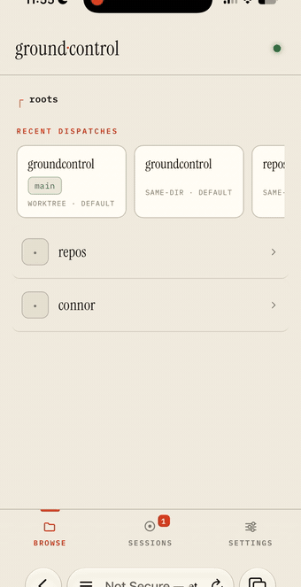
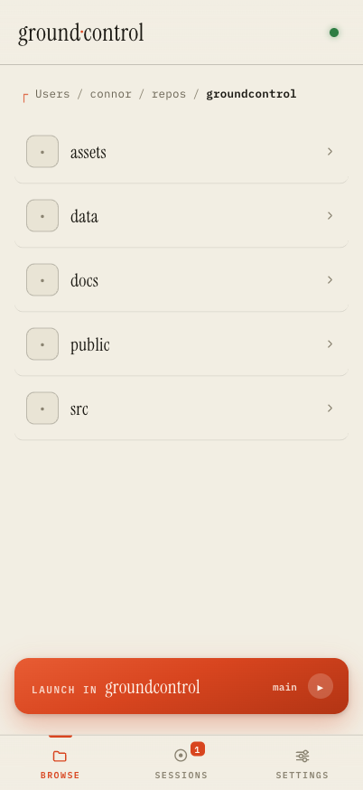
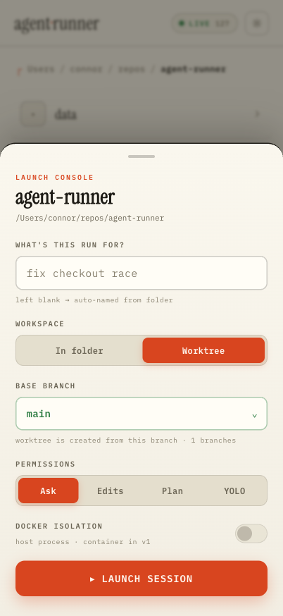
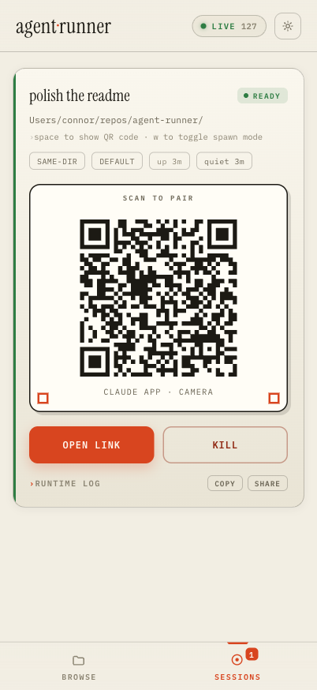

<p align="center">
  
</p>

<h1 align="center">ground·control</h1>

<p align="center">
  <em>This is ground control. Your agent is go for launch.</em>
</p>

<p align="center">
  
  
  
  
  
</p>

<p align="center">
  <strong>Browse any folder &middot; pick a branch &middot; launch Claude Code in a worktree &middot; scan the QR &middot; done</strong>
</p>

---

<p align="center">
  <a href="assets/demo.mp4"></a>
</p>
<p align="center"><sub>One take, real time, recorded on a phone. Ends where it should: in the Claude app, paired. (<a href="assets/demo.mp4">MP4</a>)</sub></p>

You know the moment. You're on the couch, you think of the fix, and the thought dies because starting a [Claude Code](https://claude.com/claude-code) session means: find the laptop, SSH in, `cd` three directories deep, run `claude remote-control`, and squint at a QR code rendered in terminal characters.

groundcontrol is the tower. It's a small home-screen app served off your own machine: browse your real filesystem, tap a folder, clear an agent for launch — optionally in a fresh git worktree off any branch — and scan a proper QR into the Claude app. The tower is never in the conversation; once paired, you're talking straight to Claude Code. groundcontrol just tracks what's in flight, holds the worktrees, and keeps the flight log.

## Before / after

Before:

```
$ ssh laptop
$ cd repos/checkout-service
$ git worktree add ../checkout-fix -b fix/race main   # remember the flags?
$ cd ../checkout-fix
$ claude remote-control
  ▄▄▄▄▄▄▄ ▄  ▄▄ ▄▄▄▄▄▄▄     ← now photograph your terminal
```

After: open the app, tap the folder, tap **Launch**, scan.

<p align="center">
  
  
  
</p>

## What it does

- **Browses your actual filesystem** from configured roots — no repo allowlist to maintain. Git repos get a branch chip; subfolders of a repo inherit its git context, so launching from `src/` still offers the repo's branches.
- **A branch picker on every git launch.** *In folder* switches the checkout to the branch you pick (refused if you have uncommitted changes — your mess is safe). *Worktree* cuts a private `gc/<session>` branch from any base — local or remote — under `~/.groundcontrol/worktrees/`, so launching off the branch you're standing on just works. Session branches are deleted on cleanup only when fully merged; dirty worktrees are never force-deleted — kept, listed in Settings, cleaned when you say so.
- **Permission modes per launch:** Ask, accept-Edits, Plan, or YOLO (`--dangerously-skip-permissions`). YOLO in a folder with no git history takes a deliberate second tap — no undo exists there, so the button makes you mean it.
- **Live session cards** with pairing QR, one-tap open-in-Claude-app, runtime log tail, uptime and last-output age, and a kill switch that updates instantly.
- **Recent dispatches:** your last launches as one-tap relaunch chips, with staleness detection — if the branch is gone, the chip says so and degrades gracefully.
- **Survives restarts honestly.** Sessions the tower lost track of show up as *lost* cards from the flight log instead of silently vanishing.
- **Webhook notifications** when a session pairs or dies, so you can put the phone down while it provisions. One generic JSON POST per lifecycle event — point it at [ntfy](https://ntfy.sh) (via its `?template=yes` params), n8n, or anything else with a URL; nothing is special-cased.
- **Installable PWA** — add to home screen, standalone window, offline shell, and it self-reloads when the server ships a new version.

## How it works

```
phone (PWA, vanilla JS) ──HTTPS via tailscale serve──▶ Go server (one static binary)
                                                          │
                                          creack/pty ─▶ claude remote-control
                                                          │
                                     scrape pairing URL ─▶ QR ─▶ Claude app
```

One static Go binary. The server spawns `claude remote-control` in a PTY, scrapes the pairing URL out of the output, and renders it as a QR. Session history lives in an append-only JSON journal that doubles as the recents list, the lost-session detector, and the audit trail. No database, no runtime dependencies, no framework — the server is one flat Go package leaning on the stdlib (plus a PTY and a QR library), the frontend three static files plus a 32-line service worker, embedded straight into the binary with `go:embed`.

## Install

You need [Go 1.24+](https://go.dev), git, and the [Claude Code CLI](https://claude.com/claude-code) logged in on the host machine (`claude` must work in a terminal there — Remote Control needs full login credentials, not an API key). Linux and macOS only.

> **0.4.0+ is a Go rewrite.** Same config format, same API, same frontend, same journal — only the runtime changed. It builds to one static binary with the web frontend embedded: no Node, no npm, no native prebuilds, no postinstall hacks. The one casualty: Windows is no longer supported (the Go PTY layer has no ConPTY support).

```bash
go install github.com/connorbell133/groundcontrol@latest
```

or build from a clone:

```bash
git clone https://github.com/connorbell133/groundcontrol.git
cd groundcontrol
go build -o groundcontrol .
```

Copy [`config.example.json`](config.example.json) to `config.json` in the directory you'll run from, then edit it: set `roots` to the folders you want browsable, and give `authToken` a value (`openssl rand -hex 16` makes a good one). Then:

```bash
./groundcontrol
```

The tower reads `config.json` from the current directory and writes its flight log to `data/journal.json` alongside it. Open `http://localhost:3020`, paste your token when asked, launch something.

### Reaching it from your phone

The tower binds to your LAN, but the pleasant way is [Tailscale](https://tailscale.com):

```bash
tailscale serve --bg 3020
```

That gives you a stable HTTPS URL on your tailnet — which also unlocks PWA installation (Add to Home Screen from Safari/Chrome) and keeps the whole thing off the public internet. The token is defense-in-depth on top of the tailnet perimeter, not a substitute for one. **Do not port-forward this to the open internet** — it launches shells on your machine; that's the entire point of it.

## Configuration

| key | what it does |
|---|---|
| `roots` | absolute paths the folder browser can see (and the only places sessions may launch) |
| `authToken` | bearer token with full access, required on every API call; empty disables auth (don't) |
| `tokens` | scoped tokens for automations: `[{name, token, scopes}]` with scopes from `read`/`launch`/`admin` — an n8n token gets `read,launch` and can never widen `roots` ([docs](docs/api.md#scoped-tokens)) |
| `webhooks` | notification subscribers: `[{url, events?}]` — each lifecycle event is POSTed as JSON to every matching URL; filter with exact names, `session.*`, `session.failed`, or `*` |
| `jobs` | headless-job bounds: `{concurrency, timeoutMs}` (default 2 parallel, 15 min) |
| `showHidden` | show dotfolders in the browser |
| `port`, `host` | where the server listens |

Everything user-facing — theme, launch defaults, roots, the notification webhook, kept-worktree cleanup — is also editable from the ⚙ Settings sheet in the app itself.

## API

Everything the app does is a bearer-token HTTP API at `/api/v1` — the PWA is just the first client. Spawn a session from a script or an n8n workflow with `POST /api/v1/sessions?wait=ready` and get the pairing URL in one round-trip; run a fully headless agent with `POST /api/v1/jobs` (`claude -p` in a fresh worktree, result + cost on your webhook); follow every lifecycle event live over SSE (`GET /api/v1/events`). [docs/api.md](docs/api.md) is the guide with a curl cookbook; [docs/openapi.yaml](docs/openapi.yaml) is the machine contract. Errors are a stable envelope (`{"error":{"code","message"}}`) — key off `code`.

## Development

```bash
go run .             # build and run from source
go vet ./...         # static checks
```

`public/` is embedded into the binary with `go:embed`, so frontend edits need a rebuild — stop and re-run `go run .` to see them.

Wire up the repo's pre-commit hook with `git config core.hooksPath .githooks`; it refuses to commit:

- secrets — [gitleaks](https://github.com/gitleaks/gitleaks) over staged changes, extended with rules for this app's own token format and Claude pairing URLs (`brew install gitleaks`)
- the private files — `config.json` and `data/` are blocked even if force-added past `.gitignore`
- broken JSON or YAML

Design notes, for the curious: the UI is a "paper dispatch" theme — Instrument Serif and IBM Plex Mono on warm paper, vermillion for actions, stamp green for anything git. Light is the baseline; dark mode is the 2am safelight, opt-in from Settings.

## What it deliberately isn't

- **Not a chat UI.** All conversation happens in the official Claude app; the tower only clears launches and supervises.
- **Not multi-tenant.** It's your machine and your token.
- **Not containerized (yet).** Sessions run as your user on the host. The Docker isolation toggle in the launch console is honest about this — it's wired for v1.

## License

[MIT](LICENSE)
