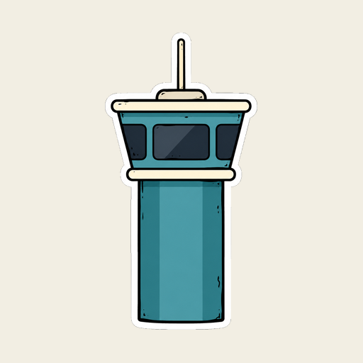

<p align="center">
  
</p>

<h1 align="center">agent·runner</h1>

<p align="center">
  <em>The laptop is upstairs. The agent launches anyway.</em>
</p>

<p align="center">
  
  
  
  
  
</p>

<p align="center">
  <strong>Browse any folder &middot; pick a branch &middot; launch Claude Code in a worktree &middot; scan the QR &middot; done</strong>
</p>

---

You know the moment. You're on the couch, you think of the fix, and the thought dies because starting a [Claude Code](https://claude.com/claude-code) session means: find the laptop, SSH in, `cd` three directories deep, run `claude remote-control`, and squint at a QR code rendered in terminal characters.

agent-runner puts that whole ritual behind two taps on your phone.

It's a small home-screen app served off your own machine: browse your real filesystem, tap a folder, launch a session — optionally in a fresh git worktree off any branch — and scan a proper QR into the Claude app. The runner is never in the interaction path; once paired, you're talking straight to Claude Code. The runner just holds the processes, the worktrees, and the receipts.

## Before / after

Before:

```
$ ssh laptop
$ cd repos/checkout-service
$ git worktree add ../checkout-fix -b fix/race main   # remember the flags?
$ cd ../checkout-fix
$ claude remote-control
  ▄▄▄▄▄▄▄ ▄  ▄▄ ▄▄▄▄▄▄▄     ← now photograph your terminal
```

After: open the app, tap the folder, tap **Launch**, scan.

<p align="center">
  
  
  
</p>

## What it does

- **Browses your actual filesystem** from configured roots — no repo allowlist to maintain. Git repos get a branch chip; subfolders of a repo inherit its git context, so launching from `src/` still offers the repo's branches.
- **Worktree launches off any branch.** Pick *In folder* or *Worktree*; worktrees are created under `~/.agent-runner/worktrees/`, and dirty ones are never force-deleted — they're kept, listed in Settings, and cleaned only when you say so.
- **Permission modes per launch:** Ask, accept-Edits, Plan, or YOLO (`--dangerously-skip-permissions`). YOLO in a folder with no git history takes a deliberate second tap — no undo exists there, so the button makes you mean it.
- **Live session cards** with pairing QR, one-tap open-in-Claude-app, runtime log tail, uptime and last-output age, and a kill switch that updates instantly.
- **Recent dispatches:** your last launches as one-tap relaunch chips, with staleness detection — if the branch is gone, the chip says so and degrades gracefully.
- **Survives restarts honestly.** Sessions the runner lost track of show up as *lost* cards from the journal instead of silently vanishing.
- **ntfy notifications** when a session pairs or dies, so you can put the phone down while it provisions.
- **Installable PWA** — add to home screen, standalone window, offline shell, and it self-reloads when the server ships a new version.

## How it works

```
phone (PWA, vanilla JS) ──HTTPS via tailscale serve──▶ Hono server (Node)
                                                          │
                                            node-pty ─▶ claude remote-control
                                                          │
                                     scrape pairing URL ─▶ QR ─▶ Claude app
```

One Node process. The server spawns `claude remote-control` in a PTY, scrapes the pairing URL out of the output, and renders it as a QR. Session history lives in an append-only JSON journal that doubles as the recents list, the lost-session detector, and the audit trail. No database, no build step, no framework — the frontend is three static files.

## Install

You need [Node 20+](https://nodejs.org), git, and the [Claude Code CLI](https://claude.com/claude-code) logged in on the host machine (`claude` must work in a terminal there — Remote Control needs full login credentials, not an API key).

```bash
git clone https://github.com/connorbell133/agent-runner.git
cd agent-runner
npm install
cp config.example.json config.json
```

Edit `config.json`: set `roots` to the folders you want browsable, and give `authToken` a value (`openssl rand -hex 16` makes a good one). Then:

```bash
npm start
```

Open `http://localhost:3020`, paste your token when asked, launch something.

### Reaching it from your phone

The runner binds to your LAN, but the pleasant way is [Tailscale](https://tailscale.com):

```bash
tailscale serve --bg 3020
```

That gives you a stable HTTPS URL on your tailnet — which also unlocks PWA installation (Add to Home Screen from Safari/Chrome) and keeps the whole thing off the public internet. The token is defense-in-depth on top of the tailnet perimeter, not a substitute for one. **Do not port-forward this to the open internet** — it launches shells on your machine; that's the entire point of it.

## Configuration

| key | what it does |
|---|---|
| `roots` | absolute paths the folder browser can see (and the only places sessions may launch) |
| `authToken` | bearer token required on every API call; empty disables auth (don't) |
| `ntfy` | server, topic, and when to notify (`notifyReady`, `notifyExit: errors\|all\|never`) |
| `showHidden` | show dotfolders in the browser |
| `port`, `host` | where the server listens |

Everything user-facing — theme, launch defaults, roots, ntfy, kept-worktree cleanup — is also editable from the ⚙ Settings sheet in the app itself.

## Development

```bash
npm run dev          # tsx watch mode
npm run typecheck    # tsc --noEmit
```

`npm install` wires up the repo's pre-commit hook (`.githooks/pre-commit`), which refuses to commit:

- secrets — [gitleaks](https://github.com/gitleaks/gitleaks) over staged changes, extended with rules for this app's own token format and Claude pairing URLs (`brew install gitleaks`)
- the private files — `config.json` and `data/` are blocked even if force-added past `.gitignore`
- broken JSON or TypeScript that doesn't typecheck

Design notes, for the curious: the UI is a "paper dispatch" theme — Instrument Serif and IBM Plex Mono on warm paper, vermillion for actions, stamp green for anything git. Light is the baseline; dark mode is the 2am safelight, opt-in from Settings.

## What it deliberately isn't

- **Not a chat UI.** All conversation happens in the official Claude app; the runner only spawns and supervises.
- **Not multi-tenant.** It's your machine and your token.
- **Not containerized (yet).** Sessions run as your user on the host. The Docker isolation toggle in the launch console is honest about this — it's wired for v1.

## License

[MIT](LICENSE)
