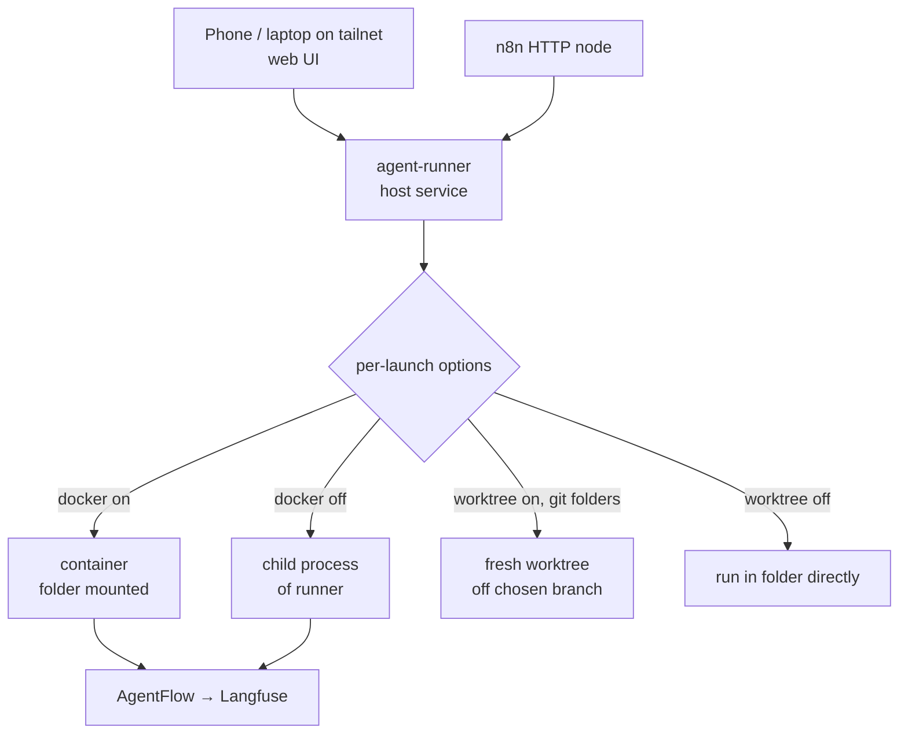

# agent-runner — Requirements

## Summary

agent-runner is a single service on the Hetzner box that launches Claude Code agents in any folder Connor picks from a filesystem browser, through two trigger paths sharing one core: a tailnet web UI for interactive `claude remote-control` sessions, and an HTTP API for headless `claude -p` jobs from n8n with webhook callbacks. Docker isolation and git worktrees are per-launch options with smart defaults, not mandates.

---

## Problem Frame

Starting a Remote Control session today requires SSH into the host, `cd`, run, and read a QR code — clumsy from a phone. n8n workflows have no way to invoke Claude Code at all: n8n runs in a container without host shell access, and running `claude -p` on the host as `connor` would expose SSH keys and credentials. Paperclip, which previously covered autonomous runs, has been decommissioned; its replacement should be one-tenth the machinery.

This is a personal tool for a personal box. The earlier claude-launchpad design (and the first draft of this PRD) locked everything behind a repo allowlist and mandatory containers; in practice the owner wants to spawn agents anywhere on the machine, with isolation available when it matters rather than enforced everywhere. Claude Code owns the hard problems — agent loop, mobile UX, auth. The runner owns only what Claude Code does not: choosing a working directory, spawning and supervising the process, and optional isolation.

---

## Key Decisions

- **Folder browser instead of a repo allowlist.** The UI browses the server's filesystem; any folder is launchable, git or not. Folders containing `.git` are badged with a git symbol. This replaces the `repos.yml` catalog from the earlier draft — a deliberate trade of lockdown for convenience on a single-owner box.
- **Isolation and worktrees are per-launch options, not rules.** Every launch offers: run in a Docker container (folder contents mounted) or as a direct child process of the runner; and, for git folders, run in a fresh worktree or directly in the folder. Defaults make the safe/clean choice without the user thinking about it.
- **Worktree semantics: one branch, one worktree.** A worktree run checks out a branch the caller chooses, or falls back to a branch with no worktree attached. A branch already attached to a live run is rejected, not queued — git's one-worktree-per-branch rule makes collisions impossible by construction.
- **Headless jobs default to Docker on.** Autonomous prompt-driven runs were the original reason for isolation; the default preserves that while the override stays one field away. Interactive sessions default to whatever the UI's per-folder memory says.
- **The runner runs on the host, not in a container.** Browsing all folders plus optional no-Docker execution means a containerized runner would need the whole filesystem mounted — host access with extra steps. A host service (e.g., systemd) is the honest shape, and it removes the need for a Docker socket-proxy sidecar for its own spawning.
- **All inference routes through the AgentFlow proxy** (`ANTHROPIC_BASE_URL`), so every run lands in Langfuse with cost attribution regardless of launch options.

---

## Actors

- A1. Connor, on a phone or laptop on the tailnet, using the web UI.
- A2. n8n (or anything on the internal network), calling the HTTP API.
- A3. The runner service, which browses folders, spawns runs, and supervises them.

---

## Requirements

**Launch surface (folder browser and UI)**

- R1. The web UI browses folders on the server from configurable roots, defaulting broad (the owner's working areas, not a confined workspace directory); subfolder navigation included.
- R2. Folders containing `.git` are visually badged with a git symbol; selecting one surfaces its current branch and branch list.
- R3. Launching with defaults takes two taps from the folder list; launch options sit behind a progressive-disclosure panel, never a mandatory form.
- R4. The UI remembers last-used launch options per folder and applies them as that folder's defaults.

**Launch options (the modular core)**

- R5. Isolation option per launch: Docker container with the chosen folder's contents mounted, or a direct child process of the runner. Available in both interactive and headless modes.
- R6. Worktree option per launch, offered only for git folders: run in a fresh worktree off a caller-chosen branch, or off a branch with no worktree attached. Non-git folders launch in place with the option hidden.
- R7. Requesting a branch already attached to a live run's worktree rejects the launch with an error naming the run that holds it.
- R8. Worktrees the runner creates are pruned when their run ends; a periodic sweep removes stale ones.
- R9. Containerized runs get default resource caps (memory, CPU), overridable per launch.

**Interactive sessions**

- R10. A session launch spawns `claude remote-control --name <name>` in the chosen folder (or its worktree) and shows the pairing URL and QR in the UI; all subsequent interaction happens in the official Claude app.
- R11. Duplicate session names are rejected. Sessions can be listed, inspected, and killed from both UI and API.
- R12. Sessions survive runner restarts: spawned runs are independent processes/containers, and the runner re-adopts them on boot (by container label or process registry).

**Headless jobs**

- R13. `POST /run` accepts folder, prompt, and optional branch, isolation, worktree, timeout, and max-turns fields; returns 202 with a job id; the run executes `claude -p` with JSON output.
- R14. On completion the runner POSTs job id, status, result, cost summary, and duration to the caller's webhook; `GET /jobs/:id` supports polling.
- R15. A concurrency limit (default 2) with a FIFO queue bounds parallel jobs; a per-job timeout (default 15 min) kills the run when exceeded.
- R16. Headless jobs default to Docker isolation; running one un-containerized requires an explicit per-job override.

**Auth and networking**

- R17. The UI and API are reachable only on the tailnet (tailscale serve); nothing is exposed to the public internet. The API requires a bearer token; the UI uses the same token.
- R18. Every run's inference routes through the AgentFlow proxy so cost and traces land in Langfuse.
- R19. Containerized runs get network egress only to AgentFlow and allowlisted git remotes; un-containerized runs inherit host networking by nature of the option.

**Observability**

- R20. `GET /healthz` serves Uptime Kuma; every run is journaled (id, folder, mode, options, prompt hash, start/end, exit, cost) in SQLite; ntfy notifies on job failure by default, completion opt-in.

---

## Acceptance Examples

- AE1. **Covers R7.** Given branch `feature-x` is checked out in a live session's worktree, when a job requests `feature-x`, then the launch is rejected with an error identifying that session — the job is not queued behind it.
- AE2. **Covers R3, R6.** Given a folder without `.git` is selected, when the launch panel opens, then no worktree option appears and launching runs the agent directly in that folder.
- AE3. **Covers R16.** Given a `POST /run` with no isolation field, when the job starts, then it runs in a Docker container with only the chosen folder mounted.
- AE4. **Covers R12.** Given a live interactive session, when the runner restarts, then the session keeps running uninterrupted and reappears in the session list after boot.
- AE5. **Covers R15.** Given a job that exceeds its timeout, when the limit passes, then the run is killed and the webhook receives a timeout status.

---

## Scope Boundaries

**Deferred for later**
- Job history UI, ntfy digests, and backup (restic) inclusion of the SQLite journal.
- Per-folder option policies beyond last-used memory (e.g., "this folder always requires Docker").

**Outside this product's identity**
- Not a coding UI, chat UI, or CI system; the Claude app and n8n own those surfaces.
- No multi-tenancy and no public internet exposure of any kind.
- Not a Firecracker/VM platform — optional Docker isolation is the deliberate ceiling for a single-owner box.

---

## Dependencies / Assumptions

- The AgentFlow proxy exists on the box and issues scoped keys with Langfuse tracing (unverified here — this repo is empty; confirmed only by the owner's PRD).
- Interactive Remote Control requires full-scope `claude auth login` credentials — inference-only setup tokens cannot establish it. Interactive runs therefore carry the owner's Claude account credentials; the "AgentFlow key is the only credential inside" property holds for containerized headless jobs only.
- Tailscale, Docker, Uptime Kuma, ntfy, and n8n are already running on the server.
- Losing runner state is a non-event: spawned runs are independent, and the journal is convenience, not truth.

---

## Outstanding Questions

**Deferred to planning**
- What user the runner (and therefore un-containerized runs) executes as — `connor` or a dedicated service user.
- Session expiry: whether idle sessions get a TTL and sweep, or live until explicitly killed.
- How containerized jobs authenticate git pushes (per-repo deploy keys vs. a shared automation key).
- Whether browse roots are a config list or genuinely the whole filesystem, and how hidden/system folders are filtered in the UI.
